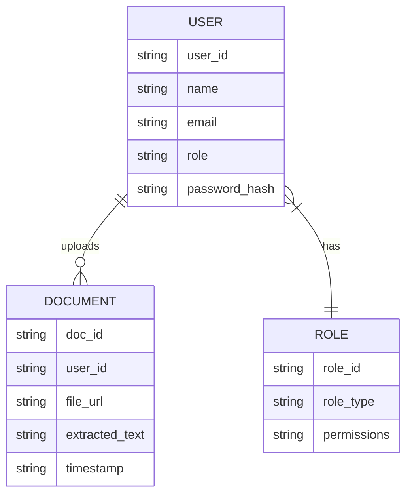

# OXOCARE 💊 – OCR powered Medical Report Assistant App

> _"Revolutionizing medical emergency responses and document scanning with smart OCR & Global Patient DB."_  
> 👨‍⚕️ Co-developed by: **Vishnupriyan P R**, **Vivek K K**, and **Akshaya K**

---

## Overview 🚀

**OXOCARE** is a smart OCR-powered Android app built to assist during medical emergencies and digitize medical documents with high accuracy, maintain records in an global patient db  
Combining **real-time alerts**, **role-based login**, and **OCR-powered scanning**, it empowers doctors, patients, and staff to handle critical health data faster and more securely than ever.

---

## Key Features 🧠

### 🔐 Multi-Role Authentication
- Supports three login types: **Doctor**, **Patient**, and **Staff**
- Secure access with role-specific dashboards and functionality
- Navigation flows tailored per user type

### 📄 Smart Medical Document Scanner (OCR)
- Scan or upload prescriptions, reports, and records
- Extracts and formats content using Google MLKit OCR
- Auto-highlights key medical info for clarity

### 📊 Organized & Interactive Output
- Parsed data displayed in a structured, readable format
- Enhances medical interpretation and record-keeping

### 🛡️ Privacy-First Architecture
- Data stored in protected Firestore database
- Role-based access control ensures confidentiality

### 🧭 Clean & Intuitive UI
- Modern dashboards for seamless experience
- Minimalist UI built with Jetpack Compose principles

---

## System Architecture 🧱

**OXOCARE bridges two major modules:**

- 🏥 `My Application` → Handles **login**, **role logic**, and **navigation**
- 🧾 `TextRecognizerApp-master` → Powers **OCR scanning**, **text analysis**, and **display UI**

---

## Workflow 🔁

1. 🔓 User logs in via their respective role (Doctor/Patient/Staff)  
2. 📷 Upload or scan a document using the OCR module  
3. 📑 Text is parsed, displayed, and saved securely  
4. 📬 Emergency or health actions can be triggered based on input  

---

## ER Diagram 🗺️



---

## 📸 App Screenshots

<p align="center">
  
  
  
</p>
<p align="center">
  
  
  
</p>

---

## Project Structure 📁

```
OXOCARE/
├── MyApplication/                  # Multi-role login and navigation
│   └── java/...                   # Android login logic and main app
├── TextRecognizerApp-master/      # OCR and document handling module
│   └── java/...                   # MLKit OCR code and display UI
├── screenshots/                   # UI screenshots (used in README)
├── .gitignore
└── README.md
```

---

## Future Scope 🔮

- 📤 Share scanned records directly with health delivery apps like **PharmEasy**, **1mg**, **Blinkit Health**, etc.
- 🧠 Integrate with **Raspberry Pi sensors** for vitals-based auto SOS triggers
- 🛠️ Expand to SQL-based database support (MySQL/PostgreSQL) for large-scale deployment
- 📡 Add push notifications and real-time alerts for doctors on emergency uploads
- 🧬 Use AI/ML to **auto-classify prescriptions vs lab reports** and suggest actions

---

## License 🧾

MIT License — Free to use, modify, and scale!

> _Built with 💉 and 💡 by Vishnupriyan P R, Vivek K K, and Akshaya K. For queries or collaborations, raise an issue or connect on GitHub._

